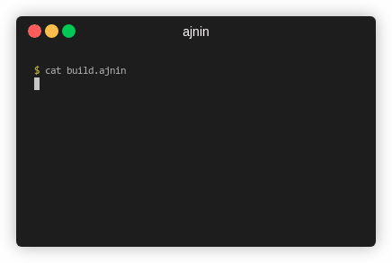

# ajnin [ˈajn in]: A Beautiful Ninja generator



Our top priority is beauty. Look at the DSL:

`build.ajnin`:

```
rule cc |= (/usr/bin/cc)
rule cc &cflags+=' -O3'

(all) << {

    list c := src/$$.c
    foreach c {
        (src/$c.c) --cc-- (build/$c.o) --ld-- (build/a.out)
    }

}
```

Run: `ajnin -o build.ninja build.ajnin`:

```ninja
build all: phony build/a.out
build build/a.out: ld build/a.o build/b.o
build build/a.o: cc src/a.c | /usr/bin/cc
    cflags =  -O3
build build/b.o: cc src/b.c | /usr/bin/cc
    cflags =  -O3
```

## Install

[git-get](https://github.com/b1f6c1c4/git-get) this repo and use CMake.
You should have already learned how to use CMake and Ninja.

## Command line

```
Usage: ajnin [-h|--help] [-d|--debug] [-o <output>] [<file>]
```

## Longer DSL example

```
# This is a comment

# The core concept in ajnin is lists.

# A list has a single-letter, case-sensitive name
# It may contain multiple items:
list a ::= item1 item2 item3

# Defining the same list twice means concatenation:
list a ::= item4

# You may also define a list by searching filesystem.
# Exactly one $$ should appear in the pattern.
list b := src/$$.cpp
#   Only the string represented by $$ will be included.
#   e.g.: If there is src/main.cpp and src/util.cpp:
#   -> list b ::= main util 

# An item of a list may contain multiple fields:
# Note that the numbers of fields don't have to match.
list c ::=
    += item1 field1-0 field1-1 field1-2
    += item2 field2-0 field2-1

# A grouped statement enumerates the items of a list.
p {
    # Like variables in bash, lists are NOT scoped:
    #   same name, same list.
    # The $p will become item1 then item2 then ...
    list b := src/$p/$$.c
}

# To access a field, use the following syntax:
# Enumeration is required to access any list.
c {
    # The $c2 will become field1-2 then "".
    list d := src/$c2/$$.c
}

# You may enumerate multiple lists at the same time.
# This is equivalent to nested grouping.
p*c {
    # Pipes are defined as follow.
    # A stage is a parenthesized path, corresponding
    #     to a source file or an artifact file.
    # An operation has one of the following syntaxes:
    #     --rule$var=list$var=list-- (one-to-one) 
    #     >>rule$var=list$var=list-- (mult-to-one) 
    # Note the two syntaxes have the SAME semantics.
    # The only difference is readability.
    (src/$p/$c.c) --cc$def=p-- (build/$p/$c.o) >>ld-- (build/bin/$p)
    # The list specifier could be a single letter (list)
    #     or a letter and a digit (field).
    # For mult-to-one, the operations declared anywhere
    #     must agree with each other.
}
```

## Legal

This project is licensed under **GNU AGPL v3.0** only. (AGPL-3.0-only).

